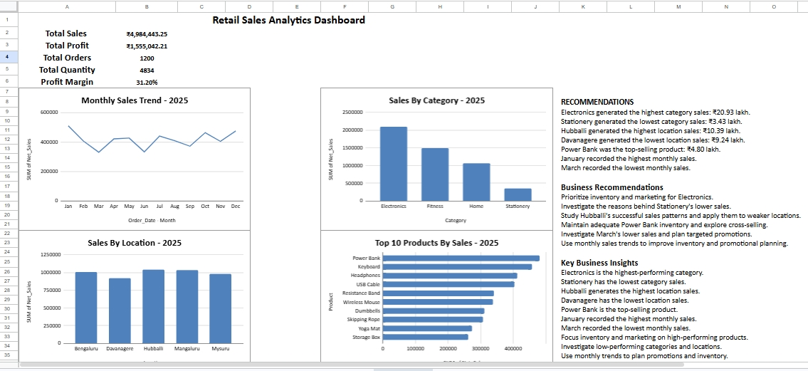

# Retail Sales Analytics Dashboard – 2025

## 📊 Project Overview

This project analyzes **1,200 retail sales transactions from 2025** and presents the results through an interactive sales analytics dashboard built using **Google Sheets**.

The dashboard helps identify sales trends, category performance, location performance, top-selling products, profitability, and key business opportunities.

## 🛠️ Tools Used

* Google Sheets
* Pivot Tables
* Charts & Data Visualization
* Spreadsheet formulas
* Business Analysis

## 📈 Dashboard KPIs

| KPI            |         Value |
| -------------- | ------------: |
| Total Sales    | ₹49,84,443.25 |
| Total Profit   | ₹15,55,042.21 |
| Total Orders   |         1,200 |
| Total Quantity |         4,834 |
| Profit Margin  |        31.20% |

## 📊 Dashboard Analysis

The dashboard includes:

* Monthly Sales Trend
* Sales by Category
* Sales by Location
* Top 10 Products by Sales
* Key Business Insights
* Business Recommendations

## 🔍 Key Business Insights

* **Electronics** generated the highest category sales at approximately **₹20.93 lakh**.
* **Stationery** generated the lowest category sales at approximately **₹3.43 lakh**.
* **Hubballi** generated the highest location sales at approximately **₹10.39 lakh**.
* **Davanagere** generated the lowest location sales at approximately **₹9.24 lakh**.
* **Power Bank** was the top-selling product at approximately **₹4.80 lakh** in sales.
* **January** recorded the highest monthly sales.
* **March** recorded the lowest monthly sales.

## 💡 Business Recommendations

* Prioritize inventory and marketing for high-performing Electronics products.
* Investigate the reasons behind lower Stationery sales.
* Analyze Hubballi's successful sales patterns and apply relevant strategies to weaker locations.
* Maintain sufficient inventory for high-demand products such as Power Bank.
* Explore cross-selling opportunities between complementary Electronics products.
* Investigate March's lower sales and consider targeted promotional campaigns.
* Use monthly sales trends to improve inventory and promotional planning.

## 🖼️ Dashboard Preview

## 🎯 Business Objective

The objective of this project is to transform raw retail transaction data into actionable business insights that can help management make better decisions related to:

* Sales performance
* Product strategy
* Inventory planning
* Marketing
* Location performance
* Customer demand

## 📌 Project Outcome

This project demonstrates practical skills in **data cleaning, data analysis, pivot tables, visualization, KPI development, and business insight generation** using Google Sheets.

It is designed as a portfolio project demonstrating how a Data Analyst can transform raw business data into a decision-support dashboard.

